# SCRUM {

Metodología de desarrollo de software que incrementar el valor añadido del producto. SCRUM forma parte de los `marcos de metodología ágil`.

<p align="center">
  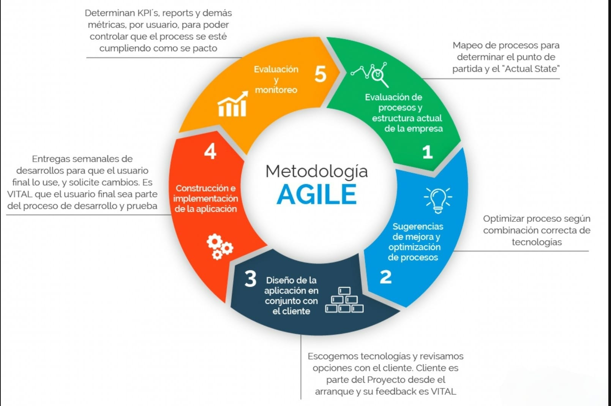
</p>

## Table of Contents

1. [¿Qué es Agile?](#1-¿qué-es-agile)
1. [Valores de Agile](#2-valores-de-agile)
1. [Introducción a SCRUM](#3-introducción-a-scrum)
1. [Componentes en SCRUM](#4-componentes-en-scrum)
1. [Eventos en SCRUM](#5-eventos-en-scrum)
1. [Artefactos en SCRUM](#6-artefactos-en-scrum)
1. [References](#references)

## 1. ¿Qué es Agile?

Agile es la habilidad para `crear productos y responder al cambio`. Durante la elaboración de un producto pueden surguir modificaciones sobre el mismo (modificaciones en el mercado, cambios en la definición de partes del proyecto, misconceptions...). Por definición, las metodologías ágiles son aquellas que permiten `adaptar la forma de trabajo a las condiciones del proyecto`, consiguiendo flexibilidad e inmediatez en la respuesta para amoldar el proyecto y su desarrollo a las circunstancias específicas del entorno.

Los sistemas tradicionales se centran en la planificación proactiva donde factores como el costo, el alcance y el tiempo son importantes, pero la gestión ágil de proyectos prioriza el `trabajo en equipo, la colaboración con los clientes y la flexibilidad`.

<p align="center">
  
</p>

Aceptar el cambio para entregar productos que respondan a las necesidades del mercado, del cliente y, en definitiva, genera valor para el usuario.

Agile agrupa muchos `marcos de trabajo`:

- Extreme Programming XP
- SCRUM
- Kanban
- Agile Inception
- Design Sprint, la metodología de Google
- (...)

Y `metodologías`:

- Pair programming
- TDD (Test-Driven Development)
- BDD (Behavior Driven Development)
- (...)

## Mentalidad: Agile Manifesto

> _We are uncovering better ways of developingsoftware by doing it and helping others do it_.

A través del tiempo vamos generando experiencia y generaremos un producto de mayor calidad para ayudar a los usuarios finales de nuestro producto.

## Diferencias entre desarrollo tradicional y desarrollo agile

|                     | Desarrollo tradicional                                                                      | Desarrollo Agile                                                                                                                               |
| ------------------- | ------------------------------------------------------------------------------------------- | ---------------------------------------------------------------------------------------------------------------------------------------------- |
| Grupos de trabajo   | Grupos grandes dónde puede ser difícil saber quién trabaja en qué.                          | Equipos pequeños con tiempos de desarrollo corto (iteración) y con un objetivo claro                                                           |
| Requerimientos      | Al inicio del proyecto quedan definidos todos los requerimientos del ciclo de vida completo | Pequeñas listas de requerimientos correspondientes a una iteración                                                                             |
| Generación de valor | Se trabaja toda la lista de requerimientos y se entrega un producto terminado               | Las entregas son graduales tras cada iteración y el cliente puede ir viendo el avance del proyecto y aplicar correcciones con un menor impacto |

## 2. Valores de Agile

1. `Individuos e interacciones` sobre procesos y herramientas
1. `Software funcionando` sobre documentación extensiva
1. `Colaboración con el cliente` sobre negociación contractual
1. `Respuesta ante el cambio` sobre seguir un plan

## Los 12 principios de Agile

1. `Satisfacción al cliente`. Entregas tempranas y continuas de software con valor.
1. `Cambios`. Son bienvenidos en cualquier etapa del proyecto, nos debemos adaptar.
1. `Software funcional`. Se entrega frecuentemente en períodos cortos de tiempo.
1. `Colaboración`. Cliente y desarrolladores trabajan juntos.
1. `Individuos motivados`. Dar un buen entorno y confianza al equipo de desarrollo para la toma de sus decisiones.
1. `Comunicación cara a cara`. Es la más eficiente y efectiva de comunicación con el equipo y el cliente, se puede evaluar lenguaje corporal.
1. `Progreso`. La medida principal de progreso es el software funcionando.
1. `Desarrollo sostenible`. El ritmo de desarrollo debe ser constante.
1. `Mejora continua`. A través de excelencia técnica y buen diseño.
1. `Simplicidad`. El arte de maximizar la cantidad de trabajo no realizado es esencial.
1. `Autoorganización`. El mejor trabajo emerge de equipos autoorganizados.
1. `Autoevaluación`. El equipo es capaz de ajustar y perfeccionar su comportamiento.

## 3. Introducción a SCRUM

Marco de trabajo ágil dónde todo el equipo colabora para lograr un mismo objetivo.

<p align="center">
  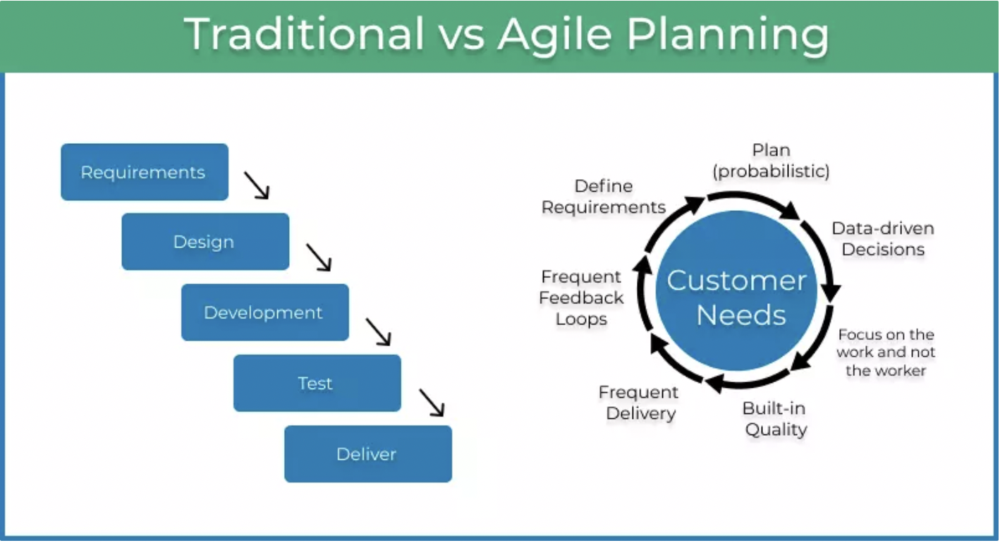
</p>

`SCRUM` es un framework (para personas, equipos de trabajo y organizaciones) que permite abordar problemas complejos a través de soluciones adaptativas, entregando productos con el máximo valor posible, de forma productiva y creativa.

La esencia de SCRUM es un `equipo pequeño de personas`: un equipo individual altamente `flexible y adaptativo`.

<p align="center" display="flex">
  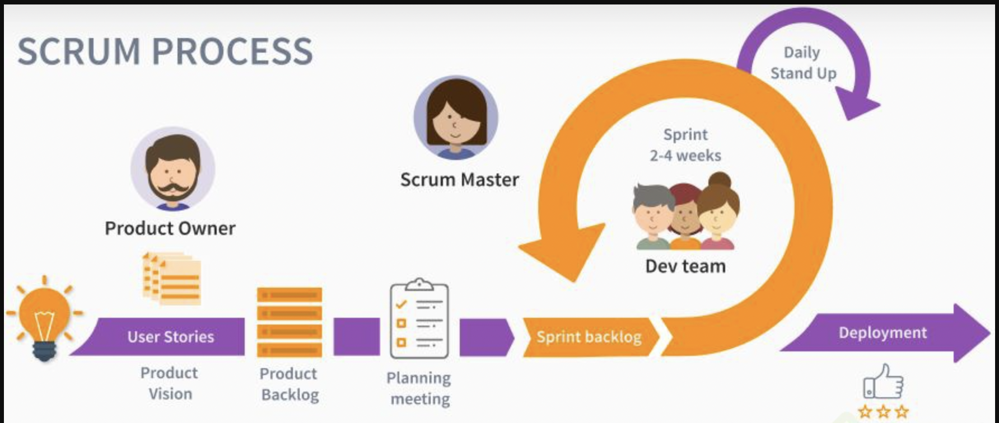
</p>

## Teoría en SCRUM

- `Empirismo`: el conocimiento proviene de la experienca y de tomar decisiones basadas en la observación, enfocándose en lo esencial
- `Iteración`: progreso incremental para optimizar previsibilidad y controlar el riesgo
- `Sprint`: eventos de duración fija (1 mes o menos) en los que las ideas se transforman en valor (incremento de producto), aumentando la previsibilidad a través de la inspección y adaptación del progreso hacia el objetivo del Producto (el PO puede cancelar un sprint)
- `Ceremonias o eventos`: Sprint planning + Daily SCRUM (daily standup) + Sprint review + Sprint retrospective
- `Artefactos`: representan el trabajo y/o valor generado, maximizando la transparencia de la información clave

## Pilares en SCRUM

1. `Transparencia`: visibilidad de todo el proceso y del trabajo realizado por parte de todos los involucrados para una mejor toma de decisiones
1. `Inspección`: detección de potenciales variaciones o problemas indeseados a través de la inspección frecuente y diligente
1. `Adaptación`: corrección y ajuste (lo más pronto posible) frente a desviaciones fuera de los límites aceptables

## Valores en SCRUM

1. `Compromiso`: para alcanzar los objetivos a través de la colaboración
1. `Enfoque`: en el trabajo designado para el sprint
1. `Apertura`: respecto al trabajo, su progreso y sus desafios
1. `Respeto`: sobre la capacidad e independencia y entre todos los miembros del equipo
1. `Coraje`: para hacer lo correcto y superar problemas difíciles

<p align="center" display="flex">
  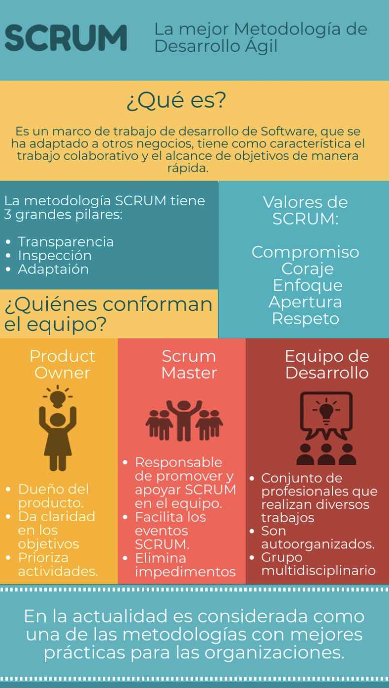
</p>

## 4. Componentes en SCRUM

> Producto Owner + Scrum Master + Developers

<p align="center" display="flex">
  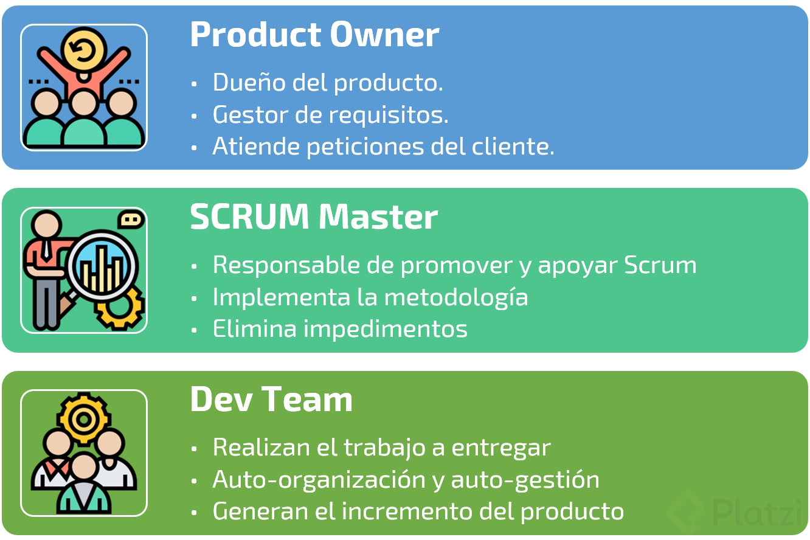
</p>

El `equipo de SCRUM` debe ser:

- `Multifuncional y auto-organizado`: sin dependencias externas (o minimizándolas)
- `Pequeño` (10 personas o menos) para mayor agilidad y productividad
- Se organiza `en base a funcionalidades o componentes`
- Realiza `entregas iterativas, incrementales y con retroalimentación constante`

Dentro del equipo existen `3 roles`:

1. `Product Owner`:

- `Representa a los diferentes stakeholders` (grupos de interés) del proyecto. Es la cara frente al cliente y, al mismo tiempo, también representa los intereses de este mismo cliente dentro del equipo de SCRUM.
- Maximiza el `valor del producto`
- Responsable de la `gestión efectiva` del Product Backlog (lista de trabajo ordenado por prioridades):

  - Definición del Product Goal
  - Creación de los elementos del Product backlog (User Stories)
  - Orden, prioridad, especificidad y visibilidad del Product Backlog

<p align="center" display="flex">
  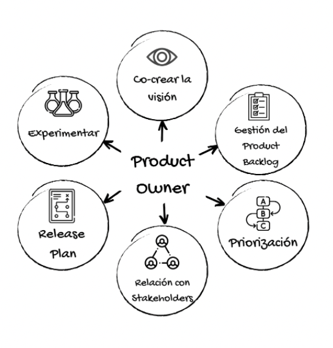
</p>

2. `Scrum master`:

- Promueve Scrum como framework de trabajo
- Se asegura de que el equipo entiende la teoría de Scrum y la implementa en la práctica para garantizar la efectividad
- Realiza coaching, mantiene el enfoque, remueve impedimentos, gestiona los eventos y ceremonias en los diferentes momentos
- Ayuda al Product Owner con la gestión del Backlog
- Es un rol de servicio, que está a disposición de todos los involucrados en el proyecto, facilitando todo para todos

<p align="center" display="flex">
  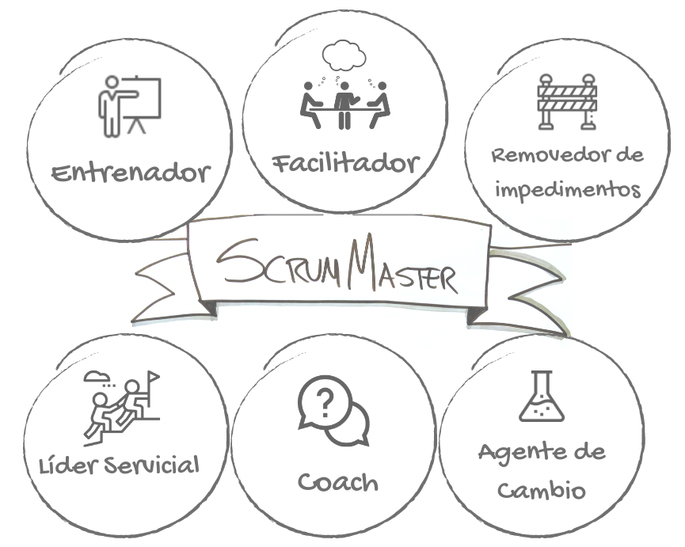
</p>

3. `Developers`:

- Crean todos los incrementos del producto y los entregan terminados en cada sprint
- Son capaces de gestionar su propio trabajo, sin títulos ni jerarquía y con una estructura fija durante al menos un sprint.
- Multifuncional: significa que está compuesto por personas con diferentes competencias necesarias para completar cada Incremento de Producto.

<p align="center" display="flex">
  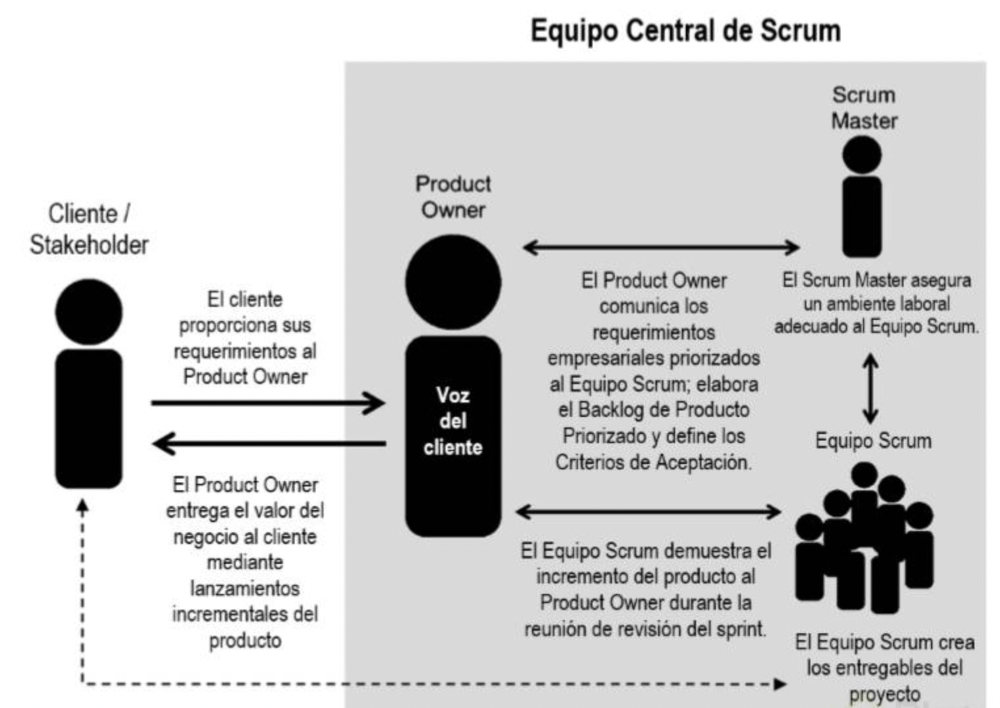
</p>

## 5. Eventos en SCRUM

En SCRUM existen `eventos predefinidos` con el fin de crear regularidad y minimizar la necesidad de reuniones no definidas en SCRUM.

<p align="center" display="flex">
  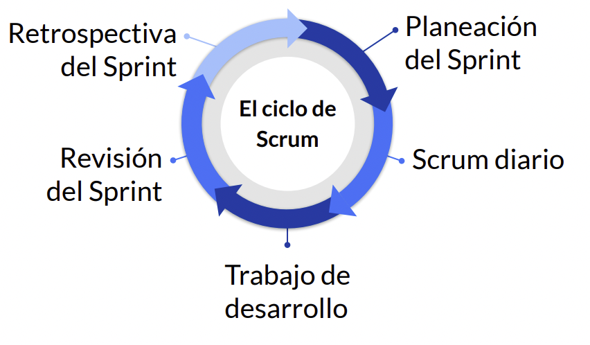
</p>

- `Sprint`: proceso delimitado en un perído de tiempo dónde el equipo trabaja un incremento del producto.

El avance en cada sprint se mide en el `Burndown chart`: El eje horizontal muestra los días del Sprint y el eje vertical muestra la cantidad de trabajo pendiente en relación al cumplimiento del objetivo y puede ser expresado en puntos de esfuerzo de los PBIs o Historias de Usuario.

<p align="center" display="flex">
  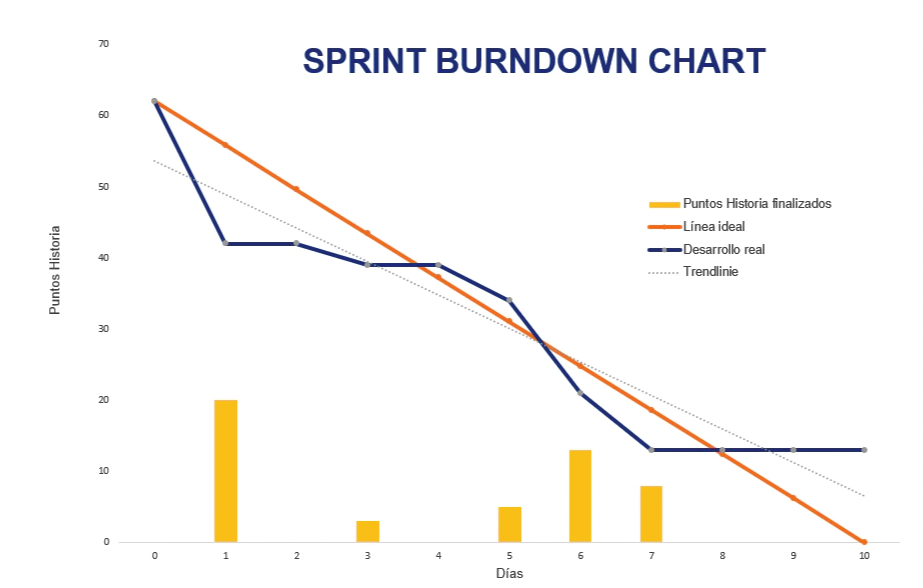
</p>

El desarrollo del trabajo con base en los sprints se visualiza en el `Cumulative flow`:

<p align="center" display="flex">
  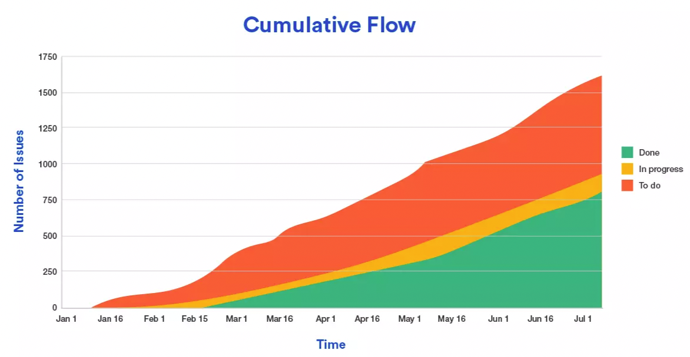
</p>

- `Sprint planning`: Todo el equipo de reune y define el trabajo a ser realizado durante el sprint. En esta reunión vamos a planificar `planificar QUÉ es lo que vamos a hacer durante el Sprint y CÓMO lo vamos a hacer`. Posee a su vez un timebox de hasta ocho horas para un Sprint de un mes. Mediremos el éxito del mismo en base a que los desarrolladores sean capaces de exponer cómo piensan alcanzar el Objetivo del Sprint con claridad. El Sprint planning debe responder:

  1. `¿Por qué es valioso este sprint?`
     El PO propone cómo incrementar valor para el producto y todo el equipo define el Sprint Goal.
  2. `¿Qué podemos entregar en este este Sprint?`
     Se eligen elementos del Product Backlog para ser incluidos en el Sprint Backlog (prioridad). Se tienen en cuenta los puntos de las User Stories, capacidad del equipo y velocidad del sprint anterior
  3. `¿Cómo se hará el trabajo elegido?`
     Una vez establecido el objetivo se aclararán dudas por parte del PO y se planificará el trabajo que requerirá cada User Story elegida para convertirse en un Increment (descomposición en pequeños tasks)

<p align="center" display="flex">
  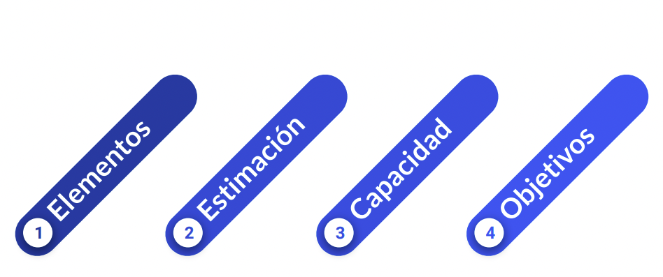
</p>

- `Daily Scrum` (daily stand-up): un bloque de tiempo de `15 minutos para que los Developers se sincronicen`. Esta `reunión diaria` se realiza a la misma hora y en el mismo lugar para reducir la complejidad. Aquí se busca la transparencia y la inspección de lo realizado para tener una oportunidad de adaptación para el día siguiente. Para ello se planea el trabajo de las siguientes 24 horas.

Los Developers usan el Daily Scrum para `evaluar su progreso hacia el Sprint Goal` y para evaluar qué tendencia sigue este progreso hacia la finalización del trabajo del Sprint en curso.

La Daily Scrum es un `evento interno de los Develoeprs`. Si el Product Owner o el Scrum Master están trabajando activamente en elementos del Sprint Backlog, participan como Developers. En la misma se debe responder a:

- ¿Qué hice ayer?
- ¿Qué haré hoy?
- ¿Tengo algún bloqueo con el que necesite ayuda?

> _¿Por qué el PBI más importante del Sprint Backlog aún no está terminado?_ -Jeff Sutherland

- `Sprint Review` cuyo objetivo es obtener feedback de los Stakeholders para inspeccionar y evaluar el producto a fin de ajustar el Product Backlog el último día del sprint actual. Durante esta ceremonia se `revisa el Incremento`, es decir, lo que se realizó durante el Sprint, y se `analizan los cambios que tuvo el Product Backlog`. Se enfoca sobre el producto funcionando (no en slides o presentaciones), no debe durar más de 4 horas y se espera un diálogo que aporte retroalimentación.

- `Sprint Retrospective` es una reunión en la cual reflexionamos sobre la manera en la que trabajamos en un periodo de tiempo. Es una oportunidad para capitalizar aprendizajes y definir acciones de mejora a futuro.

El equipo Scrum` inspecciona cómo fue el último Sprint` con respecto a las personas, las interacciones, los procesos, las herramientas y se `identifica los cambios más útiles para mejorar su efectividad`. Participa todo el equipo (Producto Owner + Scrum Master + Developers) y durante no más de 3 horas se genera un ambiente positivo y productivo dónde `identificar oportunidades de mejora`.

La retrospectiva comprende `análisis de herramientas, relaciones, personas y procesos del sprint que terminó` (¿Qué hicimos bien?, ¿Qué no hicimos bien? ¿Qué podemos mejorar?) y produce un plan de acción (enfocado en calidad y efectividad) para aplicar acciones de mejora en el próximo sprint.

## 6. Artefactos en SCRUM

Los artefactos de SCRUM representan trabajo o valor en diversas formas que son útiles para proporcionar trasnparencia y oportunidades para la inspección y adaptación. Es decir, reperesentan los elementos que quiere/espera el cliente pero que son visibles para todas las partes implicadas en el proyecto.

1. `Producto Backlog` (lista de producto): Este artefacto `contiene todas las características, funcionalidades, mejoras y correcciones (o bugs) a realizarse sobre el producto o servicio`. A cada elemento del Product Backlog se lo conoce como `Product Backlog Item (PBI)` y tiene una descripción, un orden y una estimación. Nunca está completo sino que es dinámico: `cambia constantemente` para identificar lo que el producto necesita para ser competitivo y útil en el mercado que se encuentra gracias a la `retroalimentación` con el mismo.

El compromiso del Producto Backlog es el `Product Goal`, que describe un estado futuro del producto. Cada Sprint debería acercar el producto al Product Goal.

Las `User Stories` (historias de usuario) es uno de los formatos más utilizados para redactar PBIs. Contienen `descripciones cortas de un requerimiento escritas desde el punto de vista de la persona que lo está solicitando` que por lo general es un Stakeholder o un cliente. Está compuesta por tres partes principales:

```
Cómo <tipo de usuario>, quiero <algún objetivo> para <alguna razón/propósito>.
```

<p align="center">
  
</p>

Los `principios INVEST` son una lista de 6 cualidades que nos ayudan a comprobar la calidad de una User Story:

- `“I”ndependent`: Debe ser independiente de otras historias.
- `“N”egotiable`: Su alcance y criterios deben ser variables. Los Developers deben poder negociar con el Product Owner estos criterios al comienzo del Sprint.
- `“V”aluable`: Deben aportar valor real al cliente, un incremento de producto completo.
- `“E”stimable`: Deben poder estimarse por los Developers por lo cual no deben ser demasiado grandes y debemos tener cierto conocimiento de esta a nivel negocio y técnico.
- `“S”mall`: Debe poder completarse dentro de un Sprint.
- `“T”estable`: Debe ser posible verificar que la misma está completa una vez desarrollada. Para ello debe tener claros criterios de aceptación con los cuales verificamos que esté realmente lista.

<p align="center">
  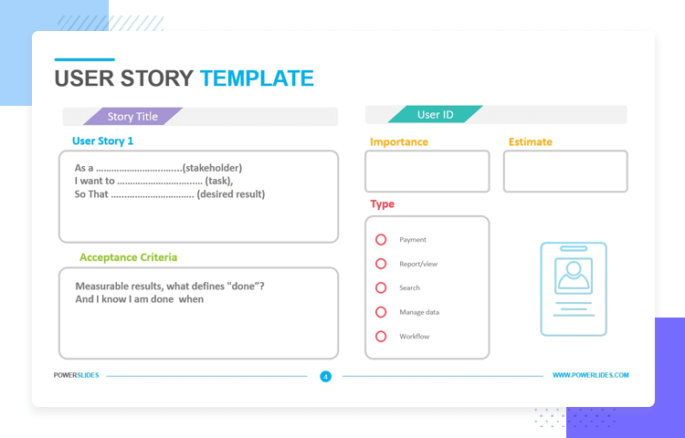
</p>

Todas las historias de usuario se pueden agrupar en elementos más grandes denominados `Èpicas`. Estas se pueden crear en base a funcionalidades o módulos del producto que se están desarrollando. Las Épicas normalmente requieren más de un Sprint para ser completadas.

2. `Sprint Backlog` (lista de pendientes del sprint): Elementos de la Lista de Producto seleccionados para el Sprint. El Sprint Backlog es otro artefacto de Scrum y se compone de los elementos del Product Backlog de la parte superior (lo más prioritario) seleccionados que se consideran necesarios a realizarse para cumplir el Objetivo del Sprint.

<p align="center">
  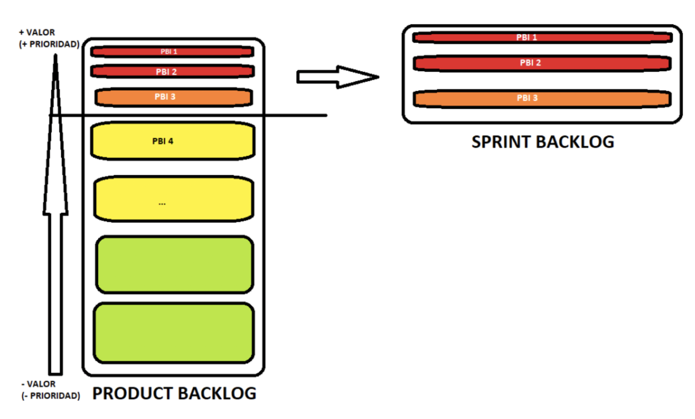
</p>

Como el Product Backlog, el Sprint Backlog está vivo, por lo que se pueden remover y agregar elementos durante el sprint priorizando según por valor, urgencia, riesgo y oportunidad.

<p align="center">
  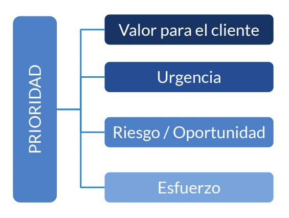
</p>

3. `Increment`: es la suma de todos los ítems del Product Backlog (PBIs) completados durante un Sprint y el valor de los incrementos de todos los Sprints pasados. Se trata de un paso hacia el Product Goal:

- Cada incremento es aditivo, es decir, debe trabajar en conjunto con los incrementos anteriores
- Cada incremento debe ser usable y funcional
- Cumple con el DoD

`Definition of Done (DoD)`: descripción formal del estado del Increment cuando cumple con las medidas de calidad requeridas para el producto. Podemos decir que es un acuerdo común que nos sirve para determinar cuándo un elemento de la lista del producto está finalizado. Si un elemento del Product Backlog no cumple con la Definition of Done, no se puede publicar ni presentar en la Sprint Review. En su lugar, vuelve al Product Backlog para su consideración futura.

`Estimación (los cerdos los que estiman, no las gallinas)`: Una estimación ágil debe ser un consenso generado desde las perspectivas de todas las áreas de desarrollo relevantes. La investigación muestra que las estimaciones son mucho mejores cuando se combinan estimaciones independientes, con iteración y retroalimentación de todos los que participan en el desarrollo.

Los términos cerdos (personas del equipo de desarrollo) y gallinas (todos los demás) nacen de la siguiente broma:

> Una gallina y un cerdo están juntos cuando la gallina dice: “¡Empecemos un restaurante!”. El cerdo lo piensa y dice: “¿Cómo llamaríamos al restaurante?”. La gallina dice: “¡Jamón y huevos!”. El cerdo dice , “No, gracias, estaría comprometido, ¡pero tú solo estarías involucrado!”

## References

- [scrum.org](https://www.scrum.org/)
- [Manifesto for Agile Software Development](https://agilemanifesto.org/iso/en/manifesto.html)
- [Principles behind the Agile Manifesto](http://agilemanifesto.org/principles.html)
- [scrumguides.org](https://scrumguides.org/download.html)
- [ittude.com](https://ittude.com.ar/b/scrum/)
- [¿Deberías usar Scrum para todos tus proyectos?](https://www2.deloitte.com/es/es/pages/technology/articles/usar-Scrum-para-todos-proyectos.html)
- [¿Qué es un SPRINT en Scrum?](https://ittude.com.ar/b/scrum/que-es-un-sprint/)
- [Certificado](https://certiprof.com/pages/scrum-foundation-professional-certificate-sfpc-spanish)
- [Estimación ágil: Los cerdos estiman](https://ittude.com.ar/b/patrones-de-scrum/estimacion-agil/)

**[⬆ back to top](#table-of-contents)**
